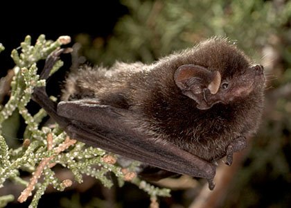
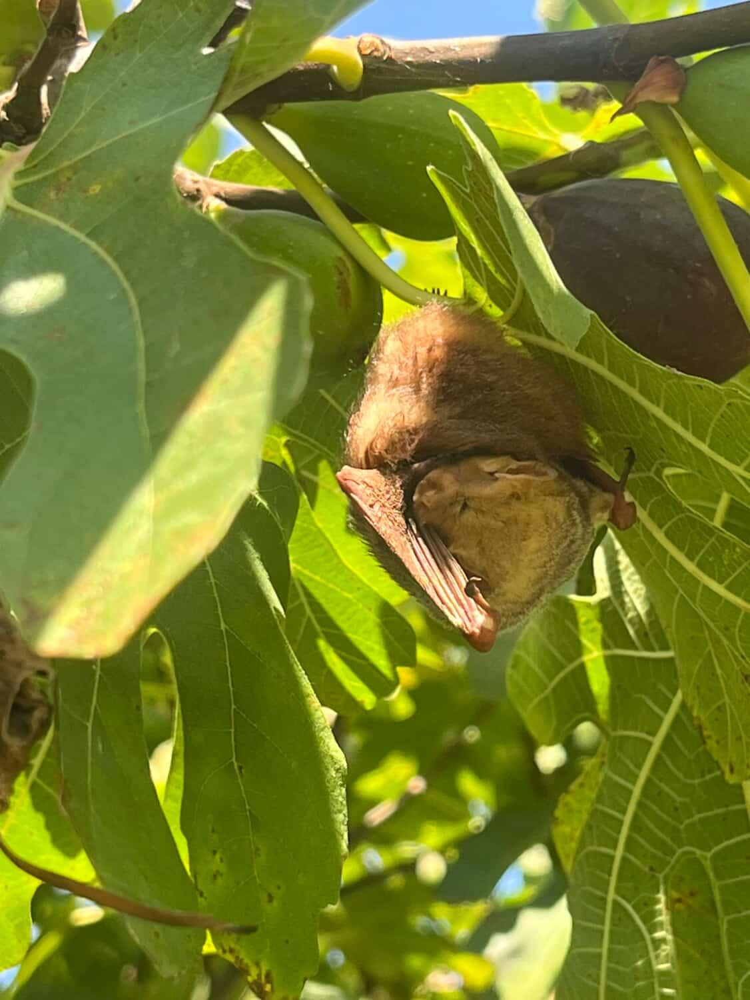

The graph below displays bat activity recorded at the GrowNYC Teaching Garden on Governor's Island, a small island just south of Manhattan. We began monitoring bat activity on May 13, 2026. This data was **last updated August 5, 2026**. The graph displays the survey nights in chronological order from left to right (x-axis) and and the number of bats detected each night are represented by the vertical peaks and valleys (y-axis).

```{r}
#| column: screen
#| fig-width: 14
#| fig-height: 6
#| out-width: "100%"

library(dplyr)
library(tidyr)
library(ggplot2)
library(tidyverse)
library(janitor)
library(readxl)
library(ggstream)
library(showtext)
library(ggtext)
#Bring Bat Data into R by folder
read_bat_folder<- function(folder, pattern="\\.txt$", reader= read.delim){
  files<-list.files(path = folder, pattern = pattern, full.names = TRUE)
  data<- lapply(files,reader)
  names(data)<- tools::file_path_sans_ext(basename(files))
  data
}

Govs<- read_bat_folder ("C:/Users/ncomp/Desktop/Bat Data/Summer of Vibes/Gov's Island")

#Count AutoID species occurences by night - May need to adjut species filter if all species were not recorded
AutoIdResults<- function(data){data<-data %>% mutate(MonitoringNight = as.Date(MonitoringNight))
Auto<- data %>% filter(SppAccp %in% c("Epfu", "Labo", "Lano", "Laci")) %>% 
  count(SppAccp, MonitoringNight)%>% complete(MonitoringNight = seq(min(MonitoringNight), max(MonitoringNight), by= "day"), fill = list(n=0)) %>% 
  pivot_wider(names_from = SppAccp, values_from = n, values_fill = 0)}

count_nightly <- function(deployment_list, location_name) {
  counts <- lapply(deployment_list, AutoIdResults)
  
  counts <- lapply(names(counts), function(file_name) {
    df <- counts[[file_name]]
    df$Location <- location_name
    df$SourceFile <- file_name
    df
  })
  
  bind_rows(counts) %>%
    arrange(Location, Epfu, Labo, Lano, Laci, SourceFile)
}

#Must supply location name after list in function
Govs_Count<- count_nightly(Govs, "Govs")


#Create Additive Line Chart, more detailed but ugly
pal=c(Epfu= "#3F0D12" , Lano= "#F1F0CC",Labo="#A71D31",Laci="#D5BF86")
Species_labels=c(Labo= "Eastern Red Bat", Laci= "Hoary Bat", Lano= "Silver-haired Bat", Epfu="Big Brown Bat")
caption_text  <- ("Data: Urban Bat Project NYC/Nic Comparato, 2026")
Additive_Line_Chart<- function(data, title){
  plot<- data %>% pivot_longer(cols = c(Epfu, Labo, Lano, Laci), names_to = "Species", values_to = "Activity") %>%
    mutate(Species=factor(Species, levels = c("Epfu","Lano","Labo", "Laci")))%>%
    ggplot(aes(x=MonitoringNight, y=Activity, fill=Species, color= Species))+
    geom_area(alpha=.85, linewidth = .2)+scale_fill_manual(values=pal, labels = Species_labels) + 
    scale_color_manual(values=pal, labels = Species_labels) +
    labs(title=title, x= "Night", y= "Bat Detections", fill= "Species", color= "Species", caption = caption_text)+
    scale_x_date(date_breaks = "7 days", date_labels = "%b %d") + 
    scale_y_continuous(breaks = scales::pretty_breaks(n=8)) +
    theme_minimal(base_size = 16)+theme(panel.background = element_rect(fill="transparent", color=NA), 
                          plot.background = element_rect(fill="transparent", color=NA))
  return(plot)
}

Additive_Line_Chart(Govs_Count, "Bat Activity on Governor's Island")


```

### A Stop Over for All of our Local Bat Species

While most of our parks within NYC tend to be dominated by our two most common species, you can see on the graph above that Governor's Island hosts a significant amount of activity from all four: eastern **red bat** (*Lasiurus borealis*), **big brown bat** (*Eptesicus fuscus*), **silver-haired bat** (*Lasionycteris noctivagans*), and **hoary bat** (*Lasiurus cinereus*). This coastal habitat may be especially easy for migrating bats to spot, but for now we can only speculate as to why Governor's Island hosts such diversity.

::::::: {style="display: flex; gap: 20px;"}
::: {style="flex: 1; margin: 0;"}
{width="100%"}

*Eastern Red Bat*
:::

::: {style="flex: 1; margin: 0;"}
{width="100%"}

*Big Brown Bat*
:::

::: {style="flex: 1; margin: 0;"}
{width="100%"} *Hoary Bat*
:::

::: {style="flex: 1; margin: 0;"}
{width="100%"} *Silver-haired Bat*
:::
:::::::

### About the GrowNYC Teaching Garden on Governor's Island

As we prepared to wrap up our research season in 2025, we received a message on Instagram about a bat visiting some fig trees on Governor's Island. Intrigued, we began chatting with the farmer that submitted the observation and GrownNYC's teaching garden on the island became a top priority site for monitoring this year.

{fig-align="center" width="293"}

Our primary contact on the island is farmer, law student, bird watcher, and bicycling wonder, Jules White. Jules has been an amazing supporter of Urban Bat Project, helping with the Governor's Island surveys and our winter research in Green-Wood Cemetery. From GrowNYC's website:

The GrowNYC Teaching Garden on Governors Island is a one-acre urban farm that aims to engage, excite, and educate New Yorkers in all aspects of urban farming and food. We hosts K-12 field trips, public workshops, and donate excess produce we grow to NYC partners from May to October. Discover the power of urban farming, fresh food, and climate action by planning your next visit!

{fig-align="center" width="323"}
