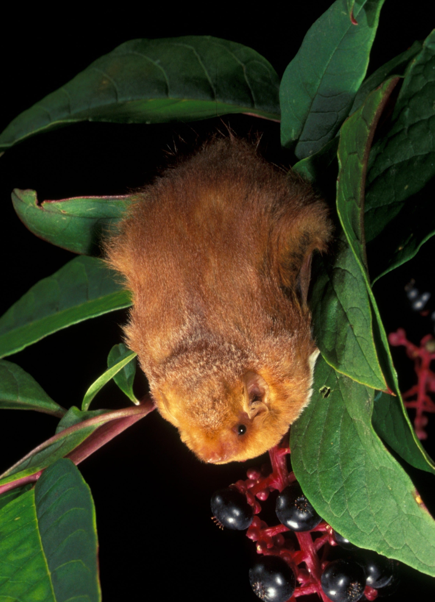
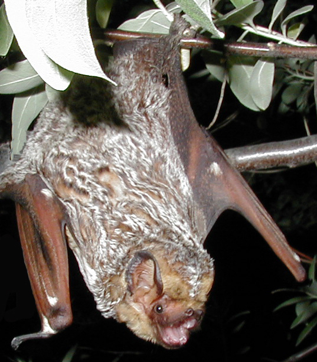

The graph below displays bat activity recorded in the Manhattan Healing Forest, our survey station is Roosevelt Island's Southpoint Park, beginning June 24, 2026. This data was **last updated August 4, 2026**. The graph displays the survey nights in chronological order from left to right (x-axis) and and the number of bats detected each night are represented by the vertical peaks and valleys (y-axis).

```{r}
#| column: screen
#| fig-width: 14
#| fig-height: 6
#| out-width: "100%"

library(dplyr)
library(tidyr)
library(ggplot2)
library(tidyverse)
library(janitor)
library(readxl)
library(ggstream)
library(showtext)
library(ggtext)
#Bring Bat Data into R by folder
read_bat_folder<- function(folder, pattern="\\.txt$", reader= read.delim){
  files<-list.files(path = folder, pattern = pattern, full.names = TRUE)
  data<- lapply(files,reader)
  names(data)<- tools::file_path_sans_ext(basename(files))
  data
}

SUGi<- read_bat_folder ("C:/Users/ncomp/Desktop/Bat Data/Summer of Vibes/Manhattan Healing")

#Count AutoID species occurences by night - May need to adjut species filter if all species were not recorded
AutoIdResults<- function(data){data<-data %>% mutate(MonitoringNight = as.Date(MonitoringNight))
Auto<- data %>% filter(SppAccp %in% c("Labo", "Laci")) %>% 
  count(SppAccp, MonitoringNight)%>% complete(MonitoringNight = seq(min(MonitoringNight), max(MonitoringNight), by= "day"), fill = list(n=0)) %>% 
  pivot_wider(names_from = SppAccp, values_from = n, values_fill = 0)}

count_nightly <- function(deployment_list, location_name) {
  counts <- lapply(deployment_list, AutoIdResults)
  
  counts <- lapply(names(counts), function(file_name) {
    df <- counts[[file_name]]
    df$Location <- location_name
    df$SourceFile <- file_name
    df
  })
  
  bind_rows(counts) %>%
    arrange(Location, Labo, Laci, SourceFile)
}

#Must supply location name after list in function
SUGi_Count<- count_nightly(SUGi, "Manhattan Healing")


#Create Additive Line Chart, more detailed but ugly
pal=c(Labo="#A71D31",Laci="#D5BF86")
Species_labels=c(Labo= "Eastern Red Bat", Laci= "Hoary Bat")
caption_text  <- ("Data: Urban Bat Project NYC/Nic Comparato, 2026")
Additive_Line_Chart<- function(data, title){
  plot<- data %>% pivot_longer(cols = c(Labo, Laci), names_to = "Species", values_to = "Activity") %>%
    mutate(Species=factor(Species, levels = c("Laci", "Labo")))%>%
    ggplot(aes(x=MonitoringNight, y=Activity, fill=Species, color= Species))+
    geom_area(alpha=.85, linewidth = .2)+scale_fill_manual(values=pal, labels = Species_labels) + 
    scale_color_manual(values=pal, labels = Species_labels) +
    labs(title=title, x= "Night", y= "Bat Detections", fill= "Species", color= "Species", caption = caption_text)+
    scale_x_date(date_breaks = "3 days", date_labels = "%b %d") + 
    scale_y_continuous(breaks = scales::pretty_breaks(n=8)) +
    theme_minimal(base_size = 16)+theme(panel.background = element_rect(fill="transparent", color=NA), 
                          plot.background = element_rect(fill="transparent", color=NA))
  return(plot)
}

Additive_Line_Chart(SUGi_Count, "Bat Activity at Manhattan Healing Forest")


```

### Eastern Red Bats and Hoary Bats: NYC's Migratory Bats of the Summer

Roosevelt Island's most common species is the **eastern red bat** (*Lasiurus borealis*), which makes up the vast majority of our bat detections at this site (depicted in the graph above in green). This is the most common bat in most of New York City throughout the summer. We also see a very small number of **hoary bats** *(Lasiurus cinereus*), an uncommon local species, on Roosevelt Island. If you look close, you can see a golden yellow sliver that starts around August 2nd, this indicates hoary bat numbers have started to pick up with the beginning of August.

Though both of these species live in New York City throughout the summer, they are migratory and will head south as temperatures begin to drop in the fall. The early August increase in hoary bat activity could represent a migratory wave of bats passing through NYC on their way to their wintering destinations.

::::: {style="display: flex; gap: 20px;"}
::: {style="flex: 1; margin: 0;"}
{width="100%"}

*Eastern Red Bat*
:::

::: {style="flex: 1; margin: 0;"}
{width="100%"}

*Hoary Bat*
:::
:::::

### About iDig2Learn and the Manhattan Healing Forest, our community partners on Roosevelt Island

Our community partner and liaison is Christina Delfico, the local organizing force behind the Manhattan Healing Forest and the founder of the nature-centric organization, [iDig2Learn](https://www.idig2learn.org/). The Manhattan Healing Forest is New York State’s first Miyawaki Method Pocket Forest. Roughly the size of a tennis court, it contains tight knit plantings of 1,500 native trees and shrubs in Southpoint Park. The pocket forest’s [funding partners SUGi](https://www.sugiproject.com/forests/manhattan-healing-forest), along with leaders from NYS’s [Roosevelt Island Operating Corporation](https://www.rioc.ny.gov/) (RIOC), the [Lenape Center](https://lenape.center/) and the [Yakama Nation](https://yakama.com/) contributed to the community planting of forty-seven native plant species in April 2024. In addition to bats, this small forest corner on Roosevelt Island is also home to kestrels, hawks, falcons, endangered Monarch butterflies and native bees.

“Creating this pocket forest is an invitation to understand how rebuilding soil health positively affects the health of all surrounding life. Using this tight-knit planting Miyawaki Method to strengthen root connections which in turn boosts tree growth exponentially mirrors how diverse communities can come close together now and do this. After all, New Yorkers understand crowded small spaces and if we can plant it here it can plant it anywhere.” -Christina Delfico, founder iDig2Learn

::::: {style="display: flex; gap: 20px;"}
::: {style="flex: 1; margin: 0;"}
{width="100%"}

*The Manhattan Healing Forest During Planting*
:::

::: {style="flex: 1; margin: 0;"}
{width="100%"}

*2 Years After Planting, photos by Dino Kuznik, courtesy of SUGi*
:::
:::::
